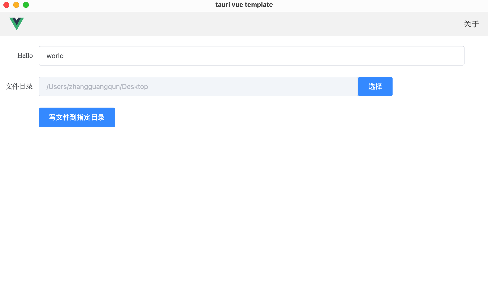

# tauri-vue-template

## 简介

这是一个 tauri 的简单的模版。基于 [tauri 的脚手架](https://tauri.app/v1/guides/getting-started/setup/html-css-js) `yarn create tauri-app` 创建出的模板，前端选择 vue2，再在此基础上集成了常用必备的前端依赖（vue-router、vuex、sass、element-ui），另外在前端调用 rust 也写了清晰简单的示例，如果有必要的话也可以参照示例快速进行业务开发。这也是从我开发的[OC工具箱](https://myitnote.com/product/octool)里抽出来的的一些基础公用的代码。

## 要不要选择使用 tauri

1. 同类的框架很多，如 electron、[wails](https://wails.io/) 等等，可以自己先对比下，然后选择适合自己的。
2. 学习完 rust ，想做个项目练手。（我就是因为这个原因使用 tauri 的。当时找了一些 rust 的 gui 的框架，最终选择了 tauri。）

## 如何使用本模版

先看下 tauri [官网](https://tauri.app/)的简介：`Build an optimized, secure, and frontend-independent application for multi-platform deployment.`，精简一点，也就是：前端独立【`frontend-independent`】、跨平台【`multi-platform deployment`】，总结一下，也就是只用写前端的代码就可以做一个跨平台的桌面应用，其实类似的跨平台框架有很多，如 Electron 等，这里不做对比。

### 怎么把本模版跑起来？

1. 先按照 tauri 官网安装前提必备的依赖。（[点击这里](https://tauri.app/v1/guides/getting-started/prerequisites)）

这里说一下，在 Windows 上，tauri 官网说明要安装 [Build Tools for Visual Studio 2022](https://visualstudio.microsoft.com/visual-cpp-build-tools/)，其实也可以安装 [Visual Studio 2022](https://visualstudio.microsoft.com/zh-hans/vs/)，根据自己的喜好选择。

Windows 在安装 Visual Studio 2022 过程中，可能出现下载很慢甚至没有没有网速的情况，这里提供我当时的解决方法：安装Visual Studio分为3个步骤：1. 下载官网的一个 exe 安装文件。（这个安装包下载还蛮快的，不会出现问题。) 2. 运行这个安装包进行安装 Visual Studio Installer。（这个过程可能出现网络不动的情况，一直处于百分之0，这个时候可以尝试修改电脑的 dns 为微软的 dns: 4.2.2.1 ，再重新运行进行安装）。3. 安装 Visual Studio Installer 完后，就要选择安装 C++桌面程序开发的组件。（这部分下载慢的话，可以按照 [这篇文章](https://zhuanlan.zhihu.com/p/323759916) 进行尝试。（非本人文章，搜索解决方法时，选的排版比较好的一篇））。

2. 安装 nodejs。（我使用版本的是 v14.18.1）

3. 安装依赖和运行。

我使用的是 yarn 装的依赖，也可以用 npm 安装。

前端的包管理器都不怎么好用，如果安装依赖出错，可是尝试删除 yarn.lock , 重新安装依赖。

```
yarn install

yarn tauri:serve
```



4. tauri 文档

tauri guides: https://tauri.app/v1/guides/

tauri api: https://tauri.app/v1/api/js/modules/app
